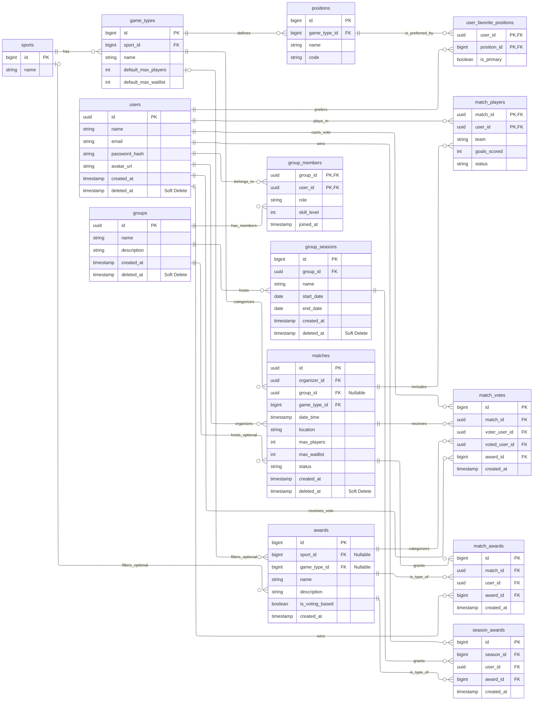

<https://mermaid.ai/app/projects/e6e4b275-85c4-42c5-b259-bc64ff0db625/diagrams/0f4916b7-d612-48ee-bded-738b8c6b2932/version/v0.1/edit>

```mermaid
---
config:
  layout: elk
---
erDiagram
    direction LR

    %% ==========================================
    %% DEFINIÇÃO DAS TABELAS
    %% ==========================================

    sports {
        bigint id PK
        string name
    }

    game_types {
        bigint id PK
        bigint sport_id FK
        string name
        int default_max_players
        int default_max_waitlist
    }

    positions {
        bigint id PK
        bigint game_type_id FK
        string name
        string code
    }

    users {
        uuid id PK
        string name
        string email
        string password_hash
        string avatar_url
        timestamp created_at
        timestamp deleted_at "Soft Delete"
    }

    user_favorite_positions {
        uuid user_id PK, FK
        bigint position_id PK, FK
        boolean is_primary
    }

    groups {
        uuid id PK
        string name
        string description
        timestamp created_at
        timestamp deleted_at "Soft Delete"
    }

    group_members {
        uuid group_id PK, FK
        uuid user_id PK, FK
        string role
        int skill_level
        timestamp joined_at
    }

    group_seasons {
        bigint id PK
        uuid group_id FK
        string name
        date start_date
        date end_date
        timestamp created_at
        timestamp deleted_at "Soft Delete"
    }

    matches {
        uuid id PK
        uuid organizer_id FK
        uuid group_id FK "Nullable"
        bigint game_type_id FK
        timestamp date_time
        string location
        int max_players
        int max_waitlist
        string status
        timestamp created_at
        timestamp deleted_at "Soft Delete"
    }

    match_players {
        uuid match_id PK, FK
        uuid user_id PK, FK
        string team
        int goals_scored
        string status
    }

    awards {
        bigint id PK
        bigint sport_id FK "Nullable"
        bigint game_type_id FK "Nullable"
        string name
        string description
        boolean is_voting_based
        timestamp created_at
    }

    match_votes {
        bigint id PK
        uuid match_id FK
        uuid voter_user_id FK
        uuid voted_user_id FK
        bigint award_id FK
        timestamp created_at
    }

    match_awards {
        bigint id PK
        uuid match_id FK
        uuid user_id FK
        bigint award_id FK
        timestamp created_at
    }

    season_awards {
        bigint id PK
        bigint season_id FK
        uuid user_id FK
        bigint award_id FK
        timestamp created_at
    }
    
    %% Relacionamentos de Base (Esportes e Posições)
    sports ||--o{ game_types : "has"
    game_types ||--o{ positions : "defines"
    
    %% Relacionamentos de Grupos e Temporadas
    groups ||--o{ group_members : "has_members"
    users ||--o{ group_members : "belongs_to"
    groups ||--o{ group_seasons : "hosts"

    %% Relacionamentos de Partidas
    users ||--o{ matches : "organizes"
    groups ||--o{ matches : "hosts_optional"
    game_types ||--o{ matches : "categorizes"
    
    %% Relacionamentos de Jogadores em Partidas e Posições
    matches ||--o{ match_players : "includes"
    users ||--o{ match_players : "plays_in"
    users ||--o{ user_favorite_positions : "prefers"
    positions ||--o{ user_favorite_positions : "is_preferred_by"

    %% Relacionamentos do Sistema de Prêmios (Awards)
    sports |o--o{ awards : "filters_optional"
    game_types |o--o{ awards : "filters_optional"

    %% Relacionamentos de Votos e Resultados (Match Awards)
    matches ||--o{ match_votes : "receives"
    users ||--o{ match_votes : "casts_vote"
    users ||--o{ match_votes : "receives_vote"
    awards ||--o{ match_votes : "categorizes"
    
    matches ||--o{ match_awards : "grants"
    users ||--o{ match_awards : "wins"
    awards ||--o{ match_awards : "is_type_of"

    %% Relacionamentos de Prêmios de Temporada
    group_seasons ||--o{ season_awards : "grants"
    users ||--o{ season_awards : "wins"
    awards ||--o{ season_awards : "is_type_of"
```